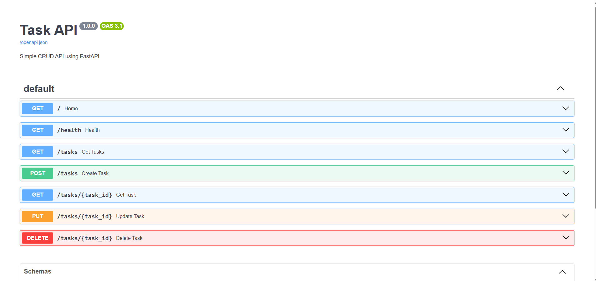

# Task API

## Description

Task API is a simple CRUD REST API built using FastAPI. It allows users to create, read, update, and delete tasks. The project stores data in memory and includes interactive API documentation using Swagger UI.

---

## Installation

Clone the repository:

```bash
git clone https://github.com/Jyoti2103singh/task-api.git
```

Go to the project folder:

```bash
cd task-api
```

Install dependencies:

```bash
pip install fastapi uvicorn ```

---

## How to Run

Start the FastAPI server:

```bash
uvicorn main:app --reload
```

Open:

```
http://127.0.0.1:8000/docs
```

to access Swagger UI.

---

## API Endpoints

| Method | Endpoint | Description |
|--------|----------|-------------|
| GET | / | API Information |
| GET | /health | Health Check |
| GET | /tasks | Get all tasks |
| GET | /tasks/{id} | Get task by ID |
| POST | /tasks | Create new task |
| PUT | /tasks/{id} | Update task |
| DELETE | /tasks/{id} | Delete task |

---

## Sample curl Output

## Example curl Output

Command:

```bash
curl -i http://127.0.0.1:8000/tasks
```

Output:

```http
HTTP/1.1 200 OK
date: Wed, 22 Jul 2026 14:33:07 GMT
server: uvicorn
content-length: 114
content-type: application/json

[{"id":1,"title":"Learn FastAPI","completed":false},{"id":2,"title":"Complete CRUD Assignment","completed":false}]
```

## Swagger UI

Open:

```
http://127.0.0.1:8000/docs
```

Insert a screenshot of the Swagger UI below.

